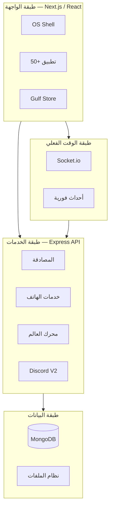
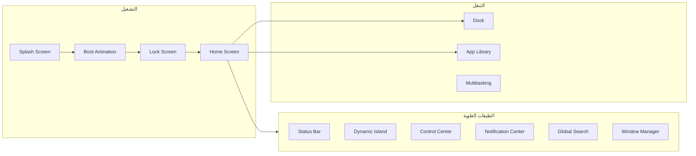
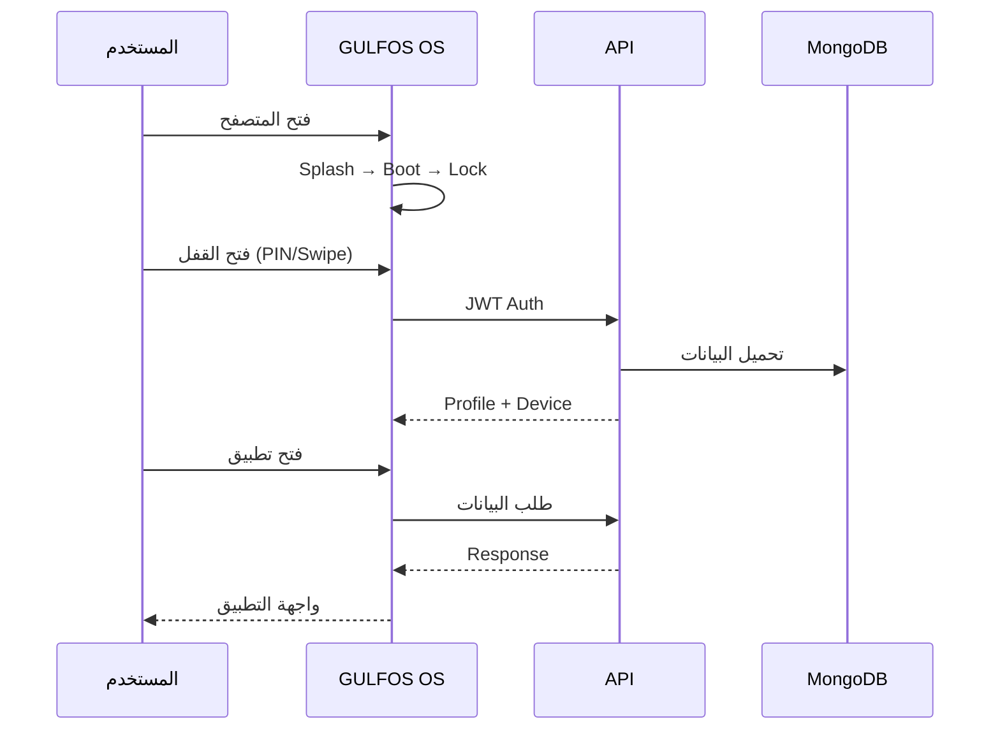
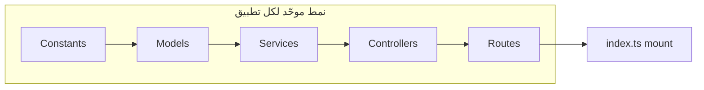
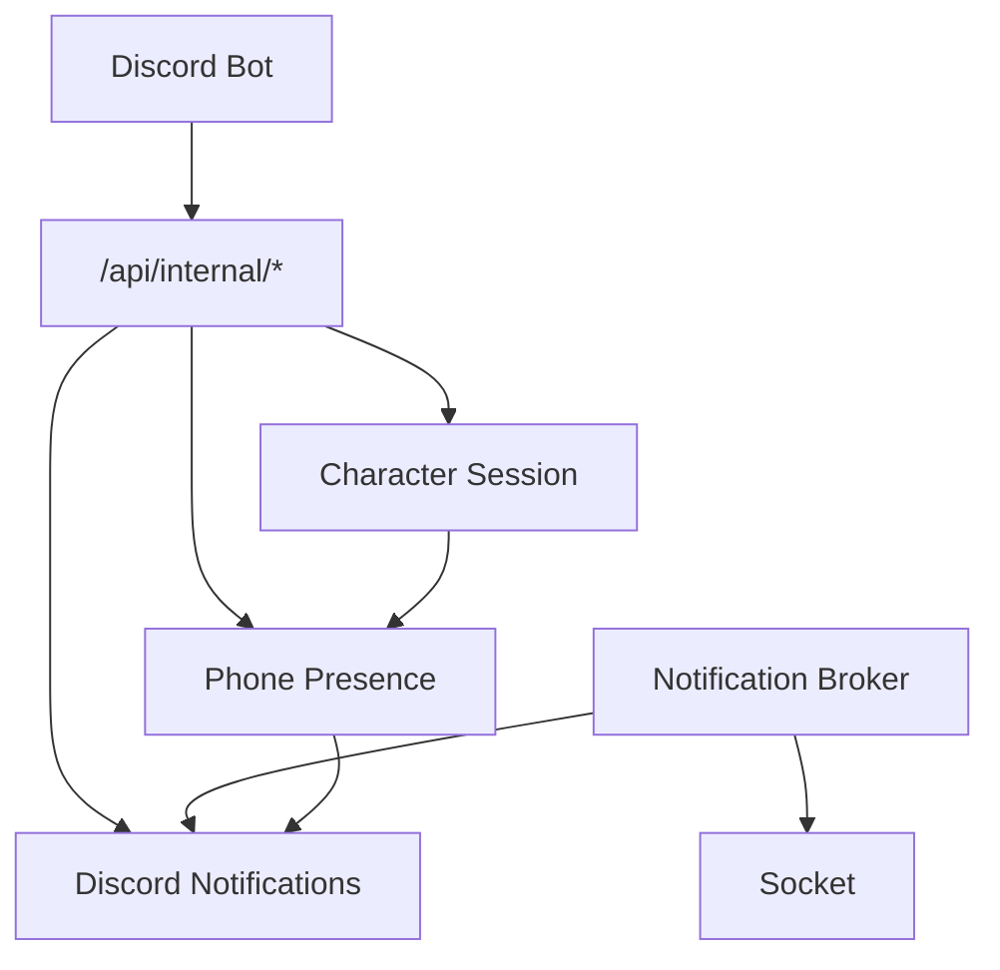

# مخطط GULFOS Phone الكامل

دليل شامل لبنية نظام الجوال الافتراضي — الطبقات، التطبيقات، والتدفقات.

---

## 1. نظرة عامة — الطبقات الأربع



---

## 2. هيكل نظام التشغيل (OS Shell)



| المكوّن | الوظيفة |
|---------|---------|
| **Lock Screen** | الساعة، الإشعارات، PIN، Face ID، السحب للفتح |
| **Home Screen** | شبكة التطبيقات، الودجات، الصفحات |
| **Dynamic Island** | المكالمات، التحميل، الأنشطة الحية |
| **Control Center** | WiFi، Bluetooth، السطوع، الصوت، الثيم |
| **Notification Center** | كل الإشعارات + البحث |
| **Gulf Store** | تحميل وتثبيت التطبيقات |

---

## 3. خريطة التطبيقات الكاملة (50+)

### أ) تطبيقات النظام الأساسية (مدمجة مسبقاً)

| الأيقونة | التطبيق | Bundle ID | الوظيفة |
|----------|---------|-----------|---------|
| ⚙️ | الإعدادات | `com.gulfos.settings` | النظام، البطارية، التخزين، الأمان |
| 🗺️ | الخرائط | `com.gulfos.maps` | GPS، المواقع، الملاحة |
| 📷 | الكاميرا | `com.gulfos.camera` | تصوير، فيديو |
| 🖼️ | المعرض | `com.gulfos.gallery` | الصور، الألبومات، AI |
| 📁 | الملفات | `com.gulfos.files` | مدير الملفات |
| 📅 | التقويم | `com.gulfos.calendar` | الأحداث، التذكيرات |
| 🕐 | الساعة | `com.gulfos.clock` | الوقت، المنبه، المؤقت |
| 🔢 | الآلة | `com.gulfos.calculator` | حسابات |
| 📝 | الملاحظات | `com.gulfos.notes` | ملاحظات نصية |
| 🎙️ | مسجل الصوت | `com.gulfos.voice-recorder` | تسجيل صوتي |
| 🌤️ | الطقس | `com.gulfos.weather` | توقعات الطقس |

### ب) تطبيقات الاتصال والهاتف

| التطبيق | Bundle ID | الوظيفة |
|---------|-----------|---------|
| 📞 Phone | `com.gulfos.phone` | مكالمات، المفضلة، البريد الصوتي |
| 👥 Contacts | `com.gulfos.contacts` | جهات الاتصال، الدمج |
| 💬 Messages | `com.gulfos.messages` | SMS، المحادثات |
| 📧 Mail | `com.gulfos.mail` | البريد الإلكتروني |
| 📶 SIM | `com.gulfos.sim` | الشريحة، الشبكة، 5G |

### ج) التطبيقات المالية والهوية

| التطبيق | Bundle ID | الوظيفة |
|---------|-----------|---------|
| 🏦 Bank | `com.gulfos.bank` | حسابات، تحويلات، QR |
| 🪪 Identity | `com.gulfos.identity` | الهوية، الرخص، الوثائق |
| 💱 Exchange | `com.gulfos.exchange` | صرف العملات |

### د) تطبيقات الحكومة والخدمات

| التطبيق | Bundle ID |
|---------|-----------|
| 🚔 Police | `com.gulfos.police` |
| ⚖️ Justice | `com.gulfos.justice` |
| 🚑 EMS | `com.gulfos.ems` |
| 🏢 Business | `com.gulfos.business` |
| 🏠 Real Estate | `com.gulfos.real-estate` |

### هـ) الأسواق والنقل

| التطبيق | Bundle ID |
|---------|-----------|
| 🚗 Vehicles | `com.gulfos.vehicles` |
| ✈️ Aviation | `com.gulfos.aviation` |
| ⚓ Marine | `com.gulfos.marine` |

### و) التطبيقات الإضافية

| التطبيق | Bundle ID |
|---------|-----------|
| 🌐 Browser | `com.gulfos.browser` |
| 💬 Chat | `com.gulfos.chat` |
| 📜 Poetry | `com.gulfos.poetry` |

### ز) منصة الذكاء والأتمتة (Phase 5)

| التطبيق | Bundle ID |
|---------|-----------|
| 🤖 Assistant | `com.gulfos.assistant` |
| ⚡ Automation | `com.gulfos.automation` |
| 🔗 Shortcuts | `com.gulfos.shortcuts` |
| 🎯 Focus | `com.gulfos.focus` |
| 🧠 Intelligence Hub | `com.gulfos.intelligence` |

### ح) الأمان والمنصة (Phase 5.4–5.5)

| التطبيق | Bundle ID |
|---------|-----------|
| 🎨 Personalization | `com.gulfos.personalization` |
| 🔒 Security | `com.gulfos.security` |
| 🛡️ Privacy | `com.gulfos.privacy` |
| ☁️ Cloud | `com.gulfos.cloud` |
| 📍 Find My | `com.gulfos.find-my` |
| 🛠️ Developer | `com.gulfos.developer` |
| 📊 Analytics | `com.gulfos.analytics` |
| 🔧 Diagnostics | `com.gulfos.diagnostics` |
| 🏛️ Enterprise | `com.gulfos.enterprise` |
| ⚡ Performance | `com.gulfos.performance` |
| 🔄 Updates | `com.gulfos.updates` |

---

## 4. تدفق المستخدم — من التشغيل إلى التطبيق



---

## 5. بنية الـ Backend لكل تطبيق



| الطبقة | المسار | مثال |
|--------|--------|------|
| Constants | `constants/bank.ts` | أذونات، حالات |
| Models | `models/BankAccount.ts` | MongoDB schema |
| Services | `services/bankService.ts` | منطق الأعمال |
| Routes | `routes/bank.ts` | `/api/bank/*` |
| Frontend | `apps/bank/` | واجهة React |

---

## 6. طبقة التكامل (Discord + Character)



| المكوّن | الوظيفة |
|---------|---------|
| **Character Ownership** | الهاتف مربوط بالشخصية وليس المستخدم |
| **Phone Presence** | `verifyPhoneAccess()` قبل كل عملية |
| **Discord V2** | إشعارات Embed ذكية عبر Provider |
| **Delivery V1** | تسليم فقط أثناء اللعب النشط |

---

## 7. خريطة صفحات الشاشة الرئيسية

```
┌─────────────────────────────────────┐
│  Status Bar: الوقت │ WiFi │ 🔋 │ 📶  │
├─────────────────────────────────────┤
│         Dynamic Island              │
├─────────────────────────────────────┤
│                                     │
│   📞  💬  📧  🏦  🪪               │
│   Phone Msg Mail Bank ID            │
│                                     │
│   📷  🖼️  📁  🗺️  ⚙️               │
│   Cam  Gal  Files Maps Settings     │
│                                     │
│   [Widgets: Weather | Calendar]     │
│                                     │
├─────────────────────────────────────┤
│  Dock: Phone │ Messages │ Store │ ⚙️ │
└─────────────────────────────────────┘

إيماءات:
  ↓ من الأعلى  → Control Center
  ↑ من الأسفل  → Multitasking
  ← من اليمين  → Notification Center
  ضغط مطول     → Global Search
```

---

## 8. Gulf Store — التطبيقات القابلة للتثبيت

التطبيقات في المتجر تُثبَّت عبر `Gulf Store` وتظهر على الشاشة الرئيسية:

1. افتح **Gulf Store** من Dock
2. سجّل دخول / أنشئ حساب
3. تصفّح أو ابحث عن التطبيق
4. اضغط **Get / Install**
5. يظهر التطبيق على Home Screen

---

## 9. الاختبار السريع

```bash
# تشغيل النظام
npm run dev

# Frontend: http://localhost:3000
# API:      http://localhost:4000

# حساب تجريبي
Email:    demo@gulfos.app
Password: Demo1234!
```

---

## 10. ملخص الأرقام

| العنصر | العدد |
|--------|-------|
| تطبيقات مسجّلة | 50+ |
| مسارات API | 40+ mount |
| نماذج MongoDB | 100+ |
| أحداث Socket | 200+ |
| فئات إشعارات Discord | 40 |
